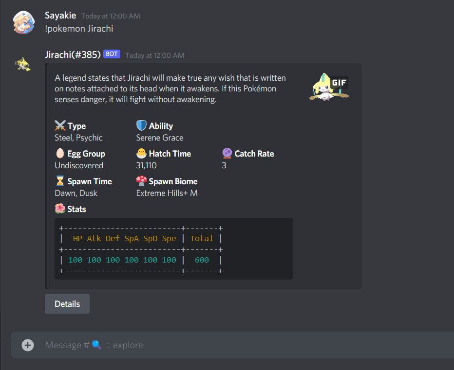

  

# Hakase

Discord bot to let y'all <b>explore Pixelmon Pokémon information</b> built around Discord Interactions.

## Contributes

There are many ways to contribute to Hakase.

* [Submit bugs] and help us verify fixes as they are checked in.
* Help each other in the [Hakase Discord server].
* [Contribute bug fixes].

## License

Licensed under the [MIT License](./LICENSE).

If you want to use any part of this source code in your project, we would be grateful if you would include some form of credit somewhere!

<!-- Link Dump --->

[Node.js]: https://nodejs.org/en/download/current/
[Redis]: https://redis.io/

[Hakase Discord server]: https://discord.gg/PZFErxEhKp
[Submit bugs]: https://github.com/Sayakie/Hakase/issues/new?labels=bug%3Aunverified
[Contribute bug fixes]: https://github.com/Sayakie/Hakase/blob/main/.github/CONTRIBUTING.md
